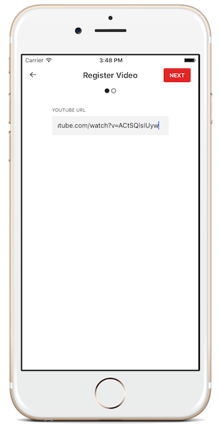
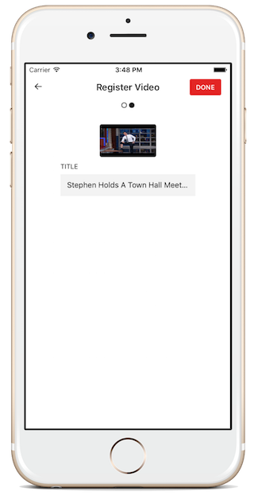
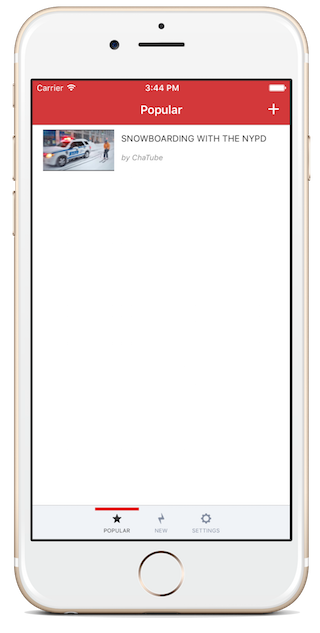
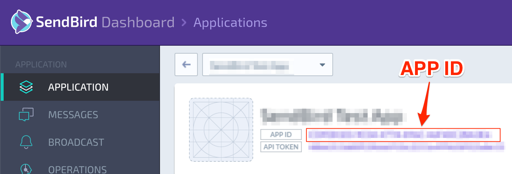

# Client-side Implementation

You will need the following frameworks to implement the client-side of BirdTube.

* YouTube iOS Player Helper
 
 [https://github.com/youtube/youtube-ios-player-helper](https://github.com/youtube/youtube-ios-player-helper)

 Framework needed to playback YouTube videos on your iOS app

* SendBird
 
 [https://github.com/smilefam/sendbird-ios-framework](https://github.com/smilefam/sendbird-ios-framework)

 Framework needed to implement public chat for the videos

* hpple

 [https://github.com/topfunky/hpple](https://github.com/topfunky/hpple)

 Framework used to parse HTML to retrieve YouTube video’s video ID, title, and thumbnail URL

* AFNetworking

 [https://github.com/AFNetworking/AFNetworking](https://github.com/AFNetworking/AFNetworking)
 
 Framework used to load images on UIImageView from a URL
 
## User Signup Process

A signup screen will be displayed when a non-member user tries to submit a video or when a user taps ‘Sign Up’ from the ‘Settings’ screen. Email and password are required for the signup.

```objectivec
// SignUpViewController.m

- (IBAction)signUp:(id)sender {
    NSString *email = [self.emailTextField text];
    NSString *password = [self.passwordTextField text];
    if ([email length] == 0 || [password length] == 0) {
        return;
    }
    NSString *nickname = [[email componentsSeparatedByCharactersInSet:[NSCharacterSet characterSetWithCharactersInString:@"@"]] objectAtIndex:0];
    if ([nickname length] == 0) {
        return;
    }
    NSString *deviceToken = @"";
    [self.indicatorView setHidden:NO];
    [self.indicatorView startAnimating];
    [Server signUpWithEmail:email nickname:nickname password:password deviceToken:deviceToken resultBlock:^(NSDictionary *response, NSError *error) {
        if (error) {
            UIAlertController *alert = [UIAlertController
                                        alertControllerWithTitle:@"Error"
                                        message:[error domain]
                                        preferredStyle:UIAlertControllerStyleAlert];
            
            UIAlertAction* closeButton = [UIAlertAction
                                          actionWithTitle:@"Close"
                                          style:UIAlertActionStyleDefault
                                          handler:^(UIAlertAction * action) {
                                              
                                          }];
            
            [alert addAction:closeButton];
            
            [self presentViewController:alert animated:YES completion:nil];
        }
        else {
            if ([[response objectForKey:@"result"] isEqualToString:@"error"]) {
                UIAlertController *alert = [UIAlertController
                                            alertControllerWithTitle:@"Error"
                                            message:[response objectForKey:@"message"]
                                            preferredStyle:UIAlertControllerStyleAlert];
                
                UIAlertAction* closeButton = [UIAlertAction
                    actionWithTitle:@"Close"
                    style:UIAlertActionStyleDefault
                    handler:^(UIAlertAction * action) {
                        
                    }];
                
                [alert addAction:closeButton];
                
                [self presentViewController:alert animated:YES completion:nil];
            }
            else {
                NSDictionary *userDict = [response objectForKey:@"user"];
                NSString *email = [userDict objectForKey:@"email"];
                NSString *nickname = [userDict objectForKey:@"nickname"];
                NSString *session = [userDict objectForKey:@"session"];
                NSString *sendbird_id = [userDict objectForKey:@"sendbird_id"];
                [MyUtils setUserID:email];
                [MyUtils setUserName:nickname];
                [MyUtils setSession:session];
                [MyUtils setSendBirdID:sendbird_id];
                UIAlertController *alert = [UIAlertController
                                         alertControllerWithTitle:@"Welcome"
                                         message:@"Thank you for signing up."
                                         preferredStyle:UIAlertControllerStyleAlert];
                
                UIAlertAction* closeButton = [UIAlertAction
                                              actionWithTitle:@"Close"
                                              style:UIAlertActionStyleDefault
                                              handler:^(UIAlertAction * action) {
                                                  [self dismissViewControllerAnimated:YES completion:nil];
                                                  [self.delegate refreshSignUpStatus];
                                              }];
                
                [alert addAction:closeButton];
                
                [self presentViewController:alert animated:YES completion:nil];
            }
        }
        [self.indicatorView setHidden:YES];
        [self.indicatorView stopAnimating];
    }];
}
```

## User Login Process

A login screen will be displayed when a non-member user tries to submit a video or when a user taps ‘Sign In’ from the ‘Settings’ screen. Email and password are required for the login.

```objectivec
// SignInViewController.m

- (IBAction)signIn:(id)sender {
    NSString *email = [self.emailTextField text];
    NSString *password = [self.passwordTextField text];
    if ([email length] == 0 || [password length] == 0) {
        return;
    }
    NSString *deviceToken = @"";
    [Server loginWithEmail:email password:password deviceToken:deviceToken resultBlock:^(NSDictionary *response, NSError *error) {
        if (error) {
            UIAlertController *alert = [UIAlertController
                                        alertControllerWithTitle:@"Error"
                                        message:[error domain]
                                        preferredStyle:UIAlertControllerStyleAlert];
            
            UIAlertAction* closeButton = [UIAlertAction
                                          actionWithTitle:@"Close"
                                          style:UIAlertActionStyleDefault
                                          handler:^(UIAlertAction * action) {
                                              
                                          }];
            
            [alert addAction:closeButton];
            
            [self presentViewController:alert animated:YES completion:nil];
        }
        else {
            if ([[response objectForKey:@"result"] isEqualToString:@"error"]) {
                UIAlertController *alert = [UIAlertController
                                            alertControllerWithTitle:@"Error"
                                            message:[response objectForKey:@"message"]
                                            preferredStyle:UIAlertControllerStyleAlert];
                
                UIAlertAction* closeButton = [UIAlertAction
                                              actionWithTitle:@"Close"
                                              style:UIAlertActionStyleDefault
                                              handler:^(UIAlertAction * action) {
                                                  
                                              }];
                
                [alert addAction:closeButton];
                
                [self presentViewController:alert animated:YES completion:nil];
            }
            else {
                NSDictionary *userDict = [response objectForKey:@"user"];
                NSString *email = [userDict objectForKey:@"email"];
                NSString *nickname = [userDict objectForKey:@"nickname"];
                NSString *session = [userDict objectForKey:@"session"];
                NSString *sendbird_id = [userDict objectForKey:@"sendbird_id"];
                [MyUtils setUserID:email];
                [MyUtils setUserName:nickname];
                [MyUtils setSession:session];
                [MyUtils setSendBirdID:sendbird_id];
                UIAlertController *alert = [UIAlertController
                                            alertControllerWithTitle:@"Welcome back"
                                            message:@"Thank you for signing in."
                                            preferredStyle:UIAlertControllerStyleAlert];
                
                UIAlertAction* closeButton = [UIAlertAction
                                              actionWithTitle:@"Close"
                                              style:UIAlertActionStyleDefault
                                              handler:^(UIAlertAction * action) {
                                                  [self dismissViewControllerAnimated:YES completion:^{
                                                      [self.delegate refreshSignInStatus];
                                                  }];
                                              }];
                
                [alert addAction:closeButton];
                
                [self presentViewController:alert animated:YES completion:nil];
            }
        }
    }];
}
```

## Submitting YouTube Video

We need to retrieve video ID, title, and thumbnail URL from the parsed HTML that’s submitted through the submitted URL. We’ll be using hpple Framework for the job.

```objectivec
// Server.m

+ (void) getYouTubeInfoUrl:(NSString *)url resultBlock:(void (^)(NSDictionary *response, NSError *error))onResult
{
    NSMutableURLRequest *request = [[NSMutableURLRequest alloc] init];
    [request setHTTPMethod:@"GET"];
    [request setValue:@"SendBird Messenger/0.9.0" forHTTPHeaderField:@"User-Agent"];
    [request setURL:[NSURL URLWithString:url]];
    
    [NSURLConnection sendAsynchronousRequest:request queue:[NSOperationQueue mainQueue] completionHandler:^(NSURLResponse *response, NSData *data, NSError *connectionError) {
        NSString *videoId = @"";
        NSString *thumbnailUrl = @"";
        NSString *name = @"";
        NSMutableDictionary *result = [[NSMutableDictionary alloc] init];
        
        NSError *error = nil;
        if (connectionError) {
            error = connectionError;
            [result setObject:@"error" forKey:@"result"];
            [result setObject:@"message" forKey:@"Connection error."];
        }
        else {
            TFHpple *doc = [[TFHpple alloc] initWithHTMLData:data];
            TFHppleElement *videoIdelements = [doc peekAtSearchWithXPathQuery:@"//meta[@itemprop='videoId']"];
            TFHppleElement *thumbnailUrlElements = [doc peekAtSearchWithXPathQuery:@"//link[@itemprop='thumbnailUrl']"];
            TFHppleElement *nameIdelements = [doc peekAtSearchWithXPathQuery:@"//meta[@itemprop='name']"];
            videoId = [videoIdelements objectForKey:@"content"];
            thumbnailUrl = [thumbnailUrlElements objectForKey:@"href"];
            name = [nameIdelements objectForKey:@"content"];
            
            [result setObject:@"success" forKey:@"result"];
            [result setObject:videoId forKey:@"videoId"];
            [result setObject:thumbnailUrl forKey:@"thumbnailUrl"];
            [result setObject:name forKey:@"name"];
        }

        NSBlockOperation *op = [[NSBlockOperation alloc] init];
        [op addExecutionBlock:^{
            onResult(result, error);
        }];
        [[NSOperationQueue mainQueue] addOperation:op];
    }];
}
```




## Browsing the List of Submitted Videos

You can browse the list of videos that users have submitted. We won’t be needing a login for browsing to make it more accessible. We’ll be implementing a simple pagination to handle a long list of videos. The cards will display the thumbnail of the video, along with the title and the nickname of the user who’ve submitted the video.

We will sort the video list in two ways for this example. Popular tab will list the videos in the order of number of views and New tab will list them in the order of submission.

```objectivec
// PopularVideoViewController.m

- (void)loadNextVideoList {
    if (hasNext == NO) {
        return;
    }
    if (offset == 0) {
        [videoArray removeAllObjects];
    }
    [Server queryVideoListOffset:offset limit:20 orderBy:1 resultBlock:^(NSDictionary *response, NSError *error) {
        if (error) {
            
        }
        else {
            if ([[response objectForKey:@"result"] isEqualToString:@"error"]) {
                
            }
            else {
                NSMutableArray<Video *> *tmpVideoArray = [[NSMutableArray alloc] init];
                for (NSDictionary *item in [response objectForKey:@"video_list"]) {
                    Video *video = [[Video alloc] initWithDic:item];
                    [tmpVideoArray addObject:video];
                    offset++;
                }
                
                if ([tmpVideoArray count] == 0) {
                    hasNext = NO;
                }
                else {
                    [videoArray addObjectsFromArray:tmpVideoArray];
                }
                [self.tableView reloadData];
            }
        }
    }];
}
```



## Viewing the Video and Chatting
If a user taps on a video from the list (Popular or New), YouTube video will start to play and the user will be able to chat with others watching the video. Users who are not logged in cannot participate in the chat and can only view the video.

```ViewPlayerViewController``` will be called when a video has been selected for viewing:

```objectivec
// PopularVideoViewController.m

- (void)tableView:(UITableView *)tableView didSelectRowAtIndexPath:(NSIndexPath *)indexPath
{
    NSIndexPath *path = indexPath;
    VideoPlayerViewController *vc = [[self storyboard] instantiateViewControllerWithIdentifier:@"VideoPlayerViewController"];
    Video *video = [videoArray objectAtIndex:[path row]];
    [Server viewVideo:[video videoID]];
    [vc setVideoData:video];

    [self.tableView deselectRowAtIndexPath:path animated:NO];
    [self presentViewController:vc animated:NO completion:nil];
}
```

When ```ViewPlayerViewController``` is called, ```viewDidLoad``` will use iOS YouTube Helper to load the video:

```objectivec
// VideoPlayerViewController.m

- (void)viewDidLoad {
    [super viewDidLoad];
    [self setNeedsStatusBarAppearanceUpdate];
    // Do any additional setup after loading the view.
    [[NSNotificationCenter defaultCenter] addObserver:self
                                             selector:@selector(keyboardWillShow:)
                                                 name:UIKeyboardWillShowNotification
                                               object:nil];
    
    [[NSNotificationCenter defaultCenter] addObserver:self
                                             selector:@selector(keyboardWillHide:)
                                                 name:UIKeyboardWillHideNotification
                                               object:nil];

    openImagePicker = NO;
    isLoadingMessage = NO;
    lastMessageTimestamp = LLONG_MIN;
    firstMessageTimestamp = LLONG_MAX;
    scrollLocked = NO;
    lightTheme = YES;
    
    messages = [[NSMutableArray alloc] init];
    
    [self.navigationBarTitle setTitle:[self.video title]];
    [self.sendFileButton.layer setBorderColor:[[UIColor blueColor] CGColor]];
    [self.sendMessageButton.layer setBorderColor:[[UIColor blueColor] CGColor]];
    [self.messageTextField.layer setBorderColor:[[UIColor blueColor] CGColor]];
    
    [self.messageTextField setDelegate:self];
    
    [self.tableView setDelegate:self];
    [self.tableView setDataSource:self];
    [self.tableView setSeparatorColor:[UIColor clearColor]];
    
    if ([[MyUtils getUserID] length] > 0 && [[MyUtils getSession] length] > 0) {
        [self startChattingWithPreviousMessage:YES];
        isLoadingMessage = YES;
    }
    else {
        [self.sendFileButton setEnabled:NO];
        [self.sendMessageButton setEnabled:NO];
        [self.messageTextField setEnabled:NO];
    }

    // For a full list of player parameters, see the documentation for the HTML5 player
    // at: https://developers.google.com/youtube/player_parameters?playerVersion=HTML5
    NSDictionary *playerVars = @{
                                 @"controls" : @0,
                                 @"playsinline" : @1,
                                 @"autohide" : @1,
                                 @"showinfo" : @0,
                                 @"modestbranding" : @1,
                                 };
    [self.playerView setDelegate:self];
    [self.playerView loadWithVideoId:self.video.videoID playerVars:playerVars];
}
```

```startChattingWithPreviousMessage:``` is used for initializing the chat. You will need to send your app’s APP ID as a parameter for [[SendBird initAppId:]](http://docs.sendbird.com/ref/ios/en/Classes/SendBird.html#//api/name/initAppId:). You can find your APP ID on [the dashboard](https://dashboard.sendbird.com) by selecting the app in development from your application list.



[[SendBird loginWithUserID:andUserName:andUserImageUrl:andAccessToken:]](http://docs.sendbird.com/ref/ios/en/Classes/SendBird.html#//api/name/loginWithUserId:andUserName:andUserImageUrl:andAccessToken:) is used to set user’s data for connecting to SendBird.

You will need to send your public chat channel’s URL for the relevant YouTube video to [[SendBird joinChannel:]](http://docs.sendbird.com/ref/ios/en/Classes/SendBird.html#//api/name/joinChannel:) as a parameter.

Then set a Callback block to handle the event after connecting to SendBird servers. The necessary Callback blocks from [[SendBird setEventHandlerConnectBlock:...]](http://docs.sendbird.com/ref/ios/en/Classes/SendBird.html#//api/name/setEventHandlerConnectBlock:errorBlock:channelLeftBlock:messageReceivedBlock:systemMessageReceivedBlock:broadcastMessageReceivedBlock:fileReceivedBlock:messagingStartedBlock:messagingUpdatedBlock:messagingEndedBlock:allMessagingEndedBlock:messagingHiddenBlock:allMessagingHiddenBlock:readReceivedBlock:typeStartReceivedBlock:typeEndReceivedBlock:allDataReceivedBlock:messageDeliveryBlock:) for implementing a public chatroom are as the following: