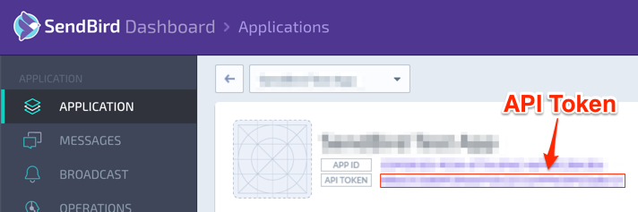

# Server-side Implementation

## Development Environment
To implement a simple server, we’ll be using Google App Engine + Python in this example. Please refer to the docs [here](https://cloud.google.com/appengine/docs/python/).

## User Model
The user model stores basic information to manage users. It has information needed for signup, chat, and a few device-related information.

```python
# models.py

class User(ndb.Model):
  email = ndb.StringProperty(required=True, indexed=True)
  nickname = ndb.StringProperty(required=True, indexed=True)
  password = ndb.StringProperty(required=True)
  session = ndb.StringProperty(required=True)
  sendbird_id = ndb.StringProperty(required=True)
  created_time = ndb.DateTimeProperty(auto_now_add=True)
  updated_time = ndb.DateTimeProperty(auto_now=True)
  device_token = ndb.StringProperty(required=True, indexed=True)
  device_type = ndb.StringProperty(required=True, choices=set(["IOS", "ANDROID", "WEB"]))
```

Each field are defined and used as the following:
* email

This is used for logging in. All users must have unique email addresses.

* password

 Password is used for login. In this example, we’ll use a simple SHA256 hash to store encrypted passwords.

* nickname

 Nickname is the display name used during chat. The initial value will be set to the local part of the email address. Users can change their nickname later.

* session

 Session key used between the client and the server.

* sendbird_id

 This is the key used to uniquely identify users during chat. A unique value needs to be assigned to the users. In this example, we’ll simply use the email addresses, but in production, it is recommended to use a different value.

* device_token, device_push

 Data used for push notifications. In this example, we won’t be building a push notification feature.

## User Signup Process
Let’s implement the request handler for the user signup process. Here, we’ll be accepting user data using JSON format through the body within POST request.

### API
```
POST /signup
```

### JSON
```json
{
  “email”: “USER@EXAMPLE.COM”,
  “nickname”: “USER_NICKNAME”,
  “password”: “USER_PASSWORD”,
  “device_token”: “DEVICE_TOKEN”,
  “device_type”: “IOS”, “ANDROID” or “WEB”
}
```

### Request Handler
```python
# main.py

class UserSignUp(webapp2.RequestHandler):
  def post(self):
    data = json.loads(self.request.body)
    check = User.query(User.email == data['email']).fetch(1)
    if len(check) > 0:
      logging.info("The email exists.")
      self.response.write(json.dumps({
          "result": "error",
          "message": "The email exists."
          }))
      return

    user = User()
    try:
      user.email = data['email']
      user.nickname = data['nickname']
      user.device_token = data['device_token']
      user.device_type = data['device_type']
      user.session = uuid.uuid4().hex
      user.sendbird_id = uuid.uuid4().hex
      user.password = User.password_encrypt(data['password'])
      user.put()
    except:
      logging.info("You cannot sign up.")
      self.response.write(json.dumps({
          "result": "error",
          "message": "You cannot sign up."
          }))
      return

    user_dict = user.to_dict()
    self.response.write(json.dumps({
        "result": "success",
        "user": user_dict
        }))
```

## User Login Process
Now, we’ll implement a request handler to process user login. We’ll be accepting JSON formatted data (email, password, device token, device type, etc.) through the body of POST request. We’ll look up a user with matching email and password, then return the user data.

### API
```
POST /signin
```

### JSON
```json
{
  “email”: “USER@EXAMPLE.COM”,
  “password”: “USER_PASSWORD”,
  “device_token”: “DEVICE_TOKEN”,
  “device_type”: “IOS”, “ANDROID” or “WEB”
}
```

### Request Handler
```python
# main.py

class UserSignIn(webapp2.RequestHandler):
  def post(self):
    data = json.loads(self.request.body)
    user_list = User.query(User.email == data['email']).fetch(1)
    if len(user_list) > 0:
      user = user_list[0]
      if user.password == User.password_encrypt(data['password']):
        user.device_token = data['device_token']
        user.device_type = data['device_type']
        user.put()
        self.response.write(json.dumps({
            "result": "success",
            "user": user.to_dict()
            }))
        return
      else:
        self.response(json.dumps({
            "result": "error",
            "message": "Password is incorrect."
            }))
        return
    else:
      self.response(json.dumps({
          "result": "error",
          "message": "User not found."
          }))
      return
```

## YouTube Video Model
The YouTube model is used to submit and manage videos. The class has the following properties:

```python
class YouTube(ndb.Model):
  url = ndb.StringProperty(required=True)
  video_id = ndb.StringProperty(required=True)
  title = ndb.StringProperty(required=True)
  thumbnail = ndb.StringProperty(required=True)
  owner = ndb.IntegerProperty(required=True, indexed=True)
  created_time = ndb.DateTimeProperty(auto_now_add=True, indexed=True)
  updated_time = ndb.DateTimeProperty(auto_now=True)
  channel_url = ndb.StringProperty(required=True)
  viewer = ndb.IntegerProperty(default=0)
```

Each field are defined and used as the following:
* url

 The URL of YouTube video
 
* video_id

 The unique ID of the video

* title

 The title of the submitted video

* thumbnail

 The thumbnail image of the submitted video

* channel_url

 The public chat channel URL assigned for the video

* viewer

 The number of times the video was viewed on BirdTube app

## Submitting YouTube Video
Since BirdTube is relying on users’ submissions, we need to implement a request handler to process videos submitted. A user needs to login first to submit, and that user will receive Session from the server. The client will send this value along with the submission request. The data required for the submission gets transferred in JSON format through the body of POST request. The server will then create a public chat channel using SendBird’s server API, and store the channel URL of the chat room within YouTube model.

You will need an API Token to use SendBird’s server API. If you haven’t already, head over to [the dashboard](https://dashboard.sendbird.com) to retrieve API Token for your app.



[Refer to the server API docs](https://sendbird.gitbooks.io/sendbird-server-api/content/en/channel.html) to learn more about creating open chat channels.

### API
```
POST /video/register
```

### JSON
```json
{
  "session": "USER_SESSION",
  "video_id": "YOUTUBE_VIDEO_ID",
  "url": "YOUTUBE_VIDEO_URL",
  "title": "YOUTUBE_VIDEO_TITLE",
  "thumbnail": "YOUTUBE_VIDEO_THUMBNAIL_URL",
}
```

### Request Handler
```python
class RegisterVideo(webapp2.RequestHandler):
  def post(self):
    data = json.loads(self.request.body)
    youtube = YouTube()
    session = data['session']
    user_list = User.query(User.session == session).fetch(1)
    if len(user_list) > 0:
      owner = user_list[0]

    try:
      youtube_list = YouTube.query(YouTube.video_id == data['video_id']).fetch(1)
      if len(youtube_list) > 0:
        self.response.write(json.dumps({
            "result": "error",
            "message": "The video is already registered."
            }))
        logging.info("The video is already registered.")
        return

      youtube.url = data['url']
      youtube.video_id = data['video_id']
      youtube.title = data['title']
      youtube.owner = owner.key.id()
      youtube.thumbnail = data['thumbnail']

      create_channel_api = "https://api.sendbird.com/channel/create"
      api_token = "<YOUR_APP_API_TOKEN>"
      request_body = {
          'auth': api_token,
          'channel_url': uuid.uuid4().hex,
          'name': data['title'],
          'cover_url': data['thumbnail'],
          'data': ""
          }
      data = json.dumps(request_body)
      req = urllib2.Request(create_channel_api, data, {'Content-Type': 'application/json'})
      f = urllib2.urlopen(req)
      response = f.read()
      logging.info(response)
      channel = json.loads(response)
      channel_url = channel['channel_url']
      youtube.channel_url = channel_url
      youtube.put()
    except:
      logging.info("error")
      self.response.write(json.dumps({
          "result": "error",
          "message": "The video can't be registered."
          }))
      return
    logging.info("success")
    self.response.write(json.dumps({
        "result": "success",
        }))
```

